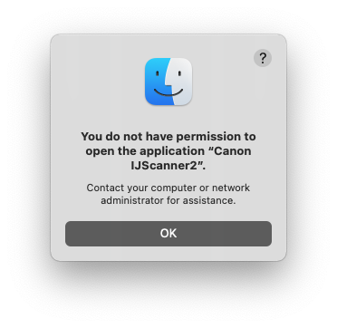

## Canon pixma scanner issue

- cd into `/Library/Image Capture/Devices`
- ls and you’ll see 
`Canon IJScanner13f.app Canon IJScanner2.app   Canon IJScanner4.app   Canon IJScanner6.app   EPSON Scanner.app`
- Open `Canon IJScanner13f.app` . Nothing will happen, but the error should be fixed

